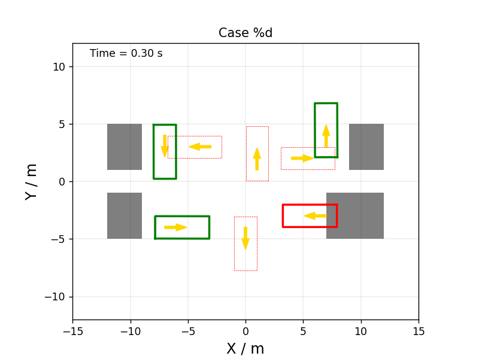

# Summary

A massively parallel implementation of a kinematic bicycle simulation in JAX on GPU. Collisions with static and dynamic convex polytopes are implemented, therefore collisions between cars are calculated. Note that this does not rely on bubble approximations.

# References 

[GPUDrive](https://github.com/Emerge-Lab/gpudrive)

