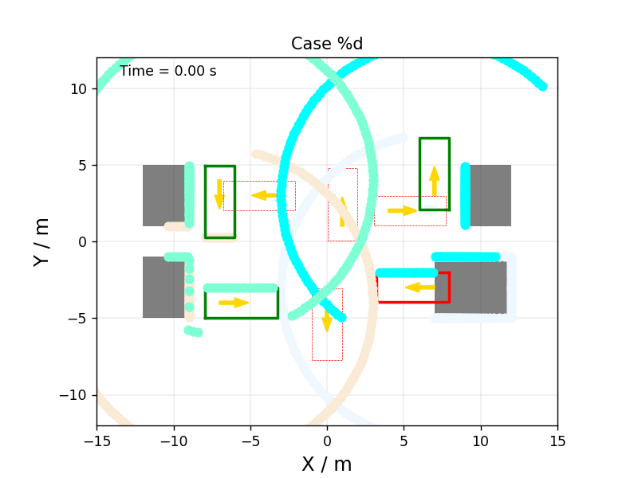

# Summary

- ~1.8 million single vehicle simulation and observation steps in demonstration scene below on an RTX 4080
- observation includes 200 lidar distance beams as visualized below
- ability to generate new scenes by describing obstacle sets and initial and goal poses for an arbitrary number of vehicles and obstacles
- collision detection only for convex state and dynamic obstacles at the moment
- collisions are done on a corner by corner basis (no bubble approximations)

# References 

[GPUDrive](https://github.com/Emerge-Lab/gpudrive)

